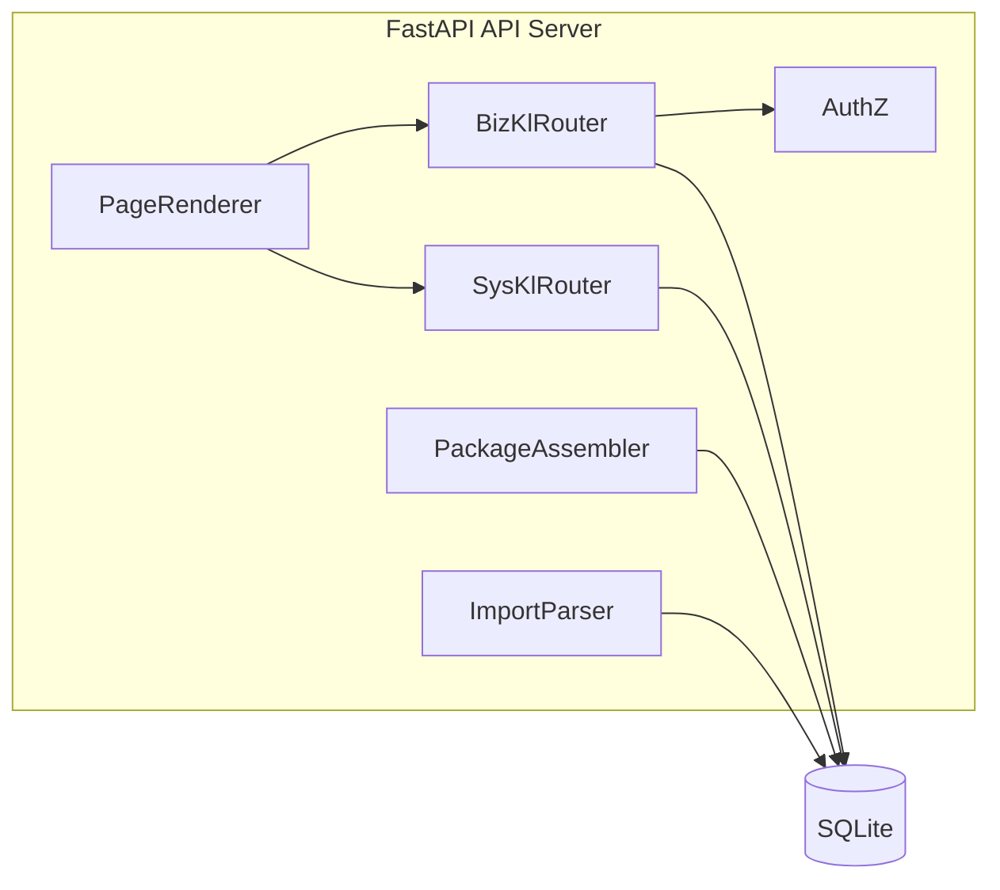

# C4 Level 3 — 组件（FastAPI API Server）

## 组件分解

| 组件 | 职责 |
|------|------|
| BizKlRouter | biz_kl CRUD、submit、publish、reject |
| SysKlRouter | sys_kl CRUD、link/unlink |
| PackageAssembler | 按 ID 组装知识包、Markdown 渲染 |
| ImportParser | biz_kl Markdown 批量导入 |
| AuthZ | `X-User-Id` 角色校验（admin publish/reject/audit） |
| PageRenderer | Jinja2 页面与 HTMX 片段 |

## 组件图

## Refine 标注的缺口

- 版本历史：当前仅 `version` 整数，缺 `biz_kl_versions` 表（P1）
- BC 边界：单 BC MVP，未建模 `bc_id`（P2）
- 角色管理 UI：users 表存在，无管理页面（P2）
