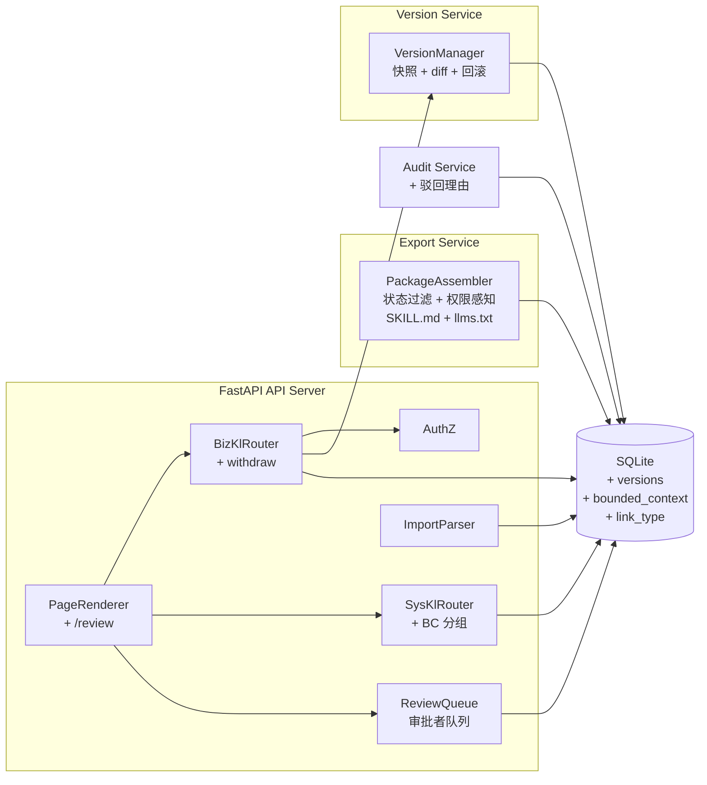

# C4 Level 3 — 组件（FastAPI API Server + Version Service）

## 组件分解

| 组件 | 所属容器 | 职责 |
|------|----------|------|
| BizKlRouter | API Server | biz_kl CRUD、submit、publish、reject、**withdraw**（ADR-006） |
| SysKlRouter | API Server | sys_kl CRUD、link/unlink、**BC 分组查询**（ADR-008） |
| PackageAssembler | Export Service | 按 ID 组装知识包、**状态过滤（仅 published）**、**权限感知**（ADR-007）、Markdown 渲染、SKILL.md + llms.txt 生成 |
| ImportParser | API Server | biz_kl Markdown 批量导入 |
| VersionManager | Version Service | 快照创建（update/publish 时）、版本列表、**diff 计算**、**回滚执行**（ADR-009） |
| ReviewQueue | API Server | **审批者队列视图**：按状态过滤 reviewing 条目（P1 gap #7） |
| AuthZ | API Server | `X-User-Id` 角色校验（admin publish/reject/audit，**expert 撤回**） |
| PageRenderer | API Server | Jinja2 页面与 HTMX 片段（**含 /review 审批队列页**） |

## 组件图

## Refine-2 标注的缺口与优先级

### P0（必须在 MVP 前修复）

| # | 缺口 | 对应组件 | ADR |
|---|------|----------|-----|
| 1 | 审核流完善：撤回 + 回滚机制 | BizKlRouter + VersionManager | ADR-006 |
| 2 | 知识包状态过滤（仅 published） | PackageAssembler | ADR-007 |
| 3 | 权限感知导出（按角色过滤） | PackageAssembler + AuthZ | ADR-007 |

### P1（Refine 阶段建议）

| # | 缺口 | 对应组件 | ADR |
|---|------|----------|-----|
| 4 | 关系类型化（link_type 字段） | SysKlRouter | ADR-008 |
| 5 | Bounded Context 归属（bounded_context 字段） | SysKlRouter + PackageAssembler | ADR-008 |
| 6 | 版本历史快照表（biz_kl_versions） | VersionManager | ADR-009 |
| 7 | 审批者队列页面（/review） | ReviewQueue + PageRenderer | ADR-006 |

### P2（后续阶段）

| # | 缺口 | 说明 |
|---|------|------|
| 8 | 知识包 SKILL.md 指南 | PackageAssembler 导出时附带 |
| 9 | llms.txt AI 发现层 | PackageAssembler 导出时附带 |
| 10 | 代码变更检测联动 | sys_kl 关联 Git commit hash，外部 webhooks 触发 |

### 已关闭的 MVP 缺口

| 原缺口 | 状态 | 说明 |
|--------|------|------|
| 版本历史：仅 version 整数 | → ADR-009 | 新增 biz_kl_versions 快照表 |
| BC 边界：无 bc_id | → ADR-008 | sys_kl_items 增加 bounded_context 字段 |
| 角色管理 UI：无管理页面 | P2 | 暂缓，用户量 ≤10 时影响低 |
