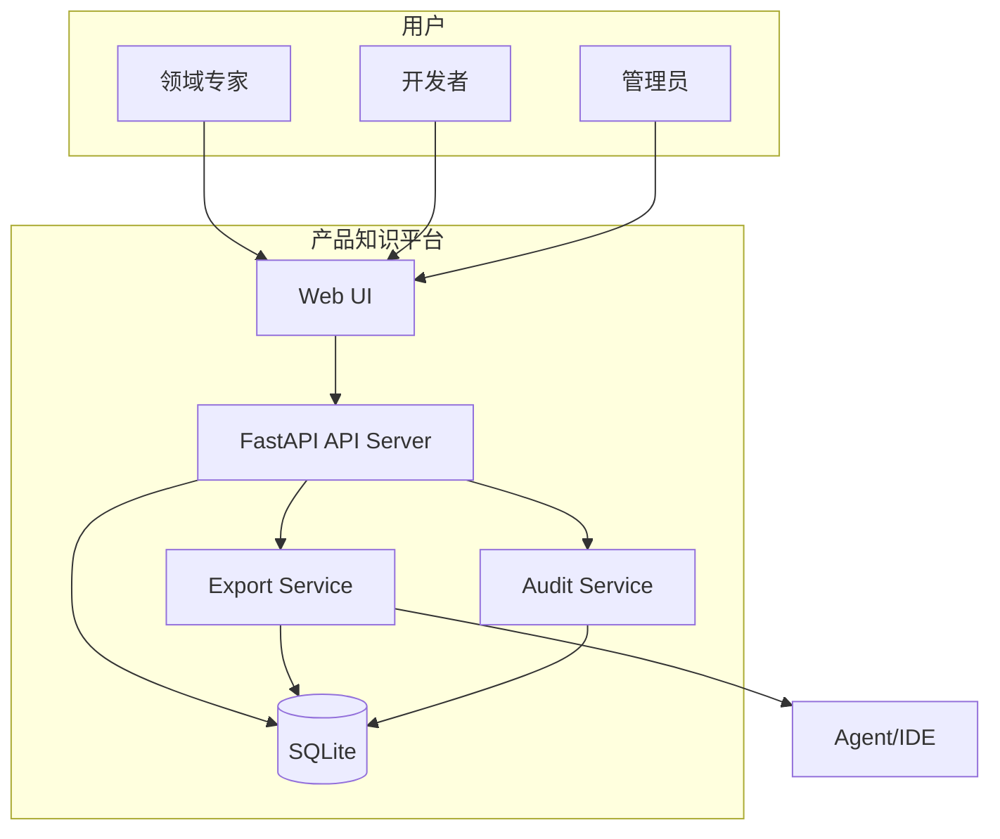

# C4 Level 2 — 容器

## 容器清单

| 容器 | 技术 | 职责 |
|------|------|------|
| Web UI | HTML + HTMX + Jinja2 | 列表、详情、审核操作、导入、审计（管理员） |
| API Server | FastAPI | REST API、页面路由、权限校验 |
| Export Service | Python（API 内模块） | 组装知识包 JSON/Markdown |
| SQLite DB | SQLite | biz_kl、sys_kl、链接、审计、用户 |
| Audit Service | Python（API 内模块） | 不可变审计日志 |

## 容器图

## ADR 映射

| ADR | 影响的容器 |
|-----|-----------|
| ADR-001 biz/sys 分离 | API、DB schema |
| ADR-004 FastAPI+SQLite+HTMX | API、UI、DB |
| ADR-005 JSON+Markdown 双格式 | Export Service |
| ADR-006（Refine）审核驳回 | API、UI、Audit Service |
