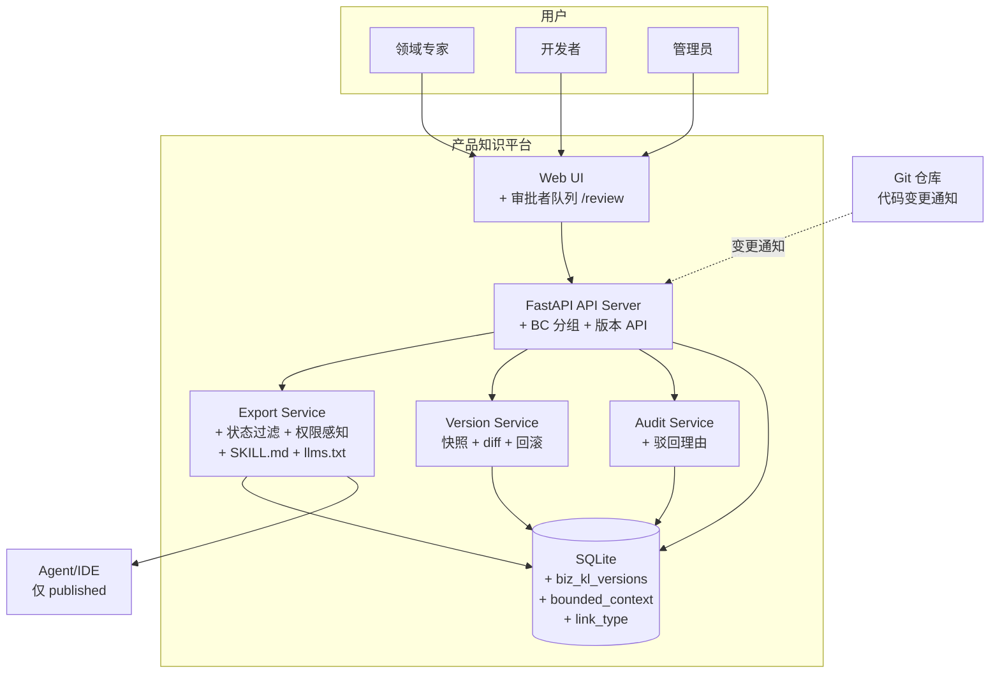

# C4 Level 2 — 容器

## 容器清单

| 容器              | 技术                   | 职责                                                                                                  |
| --------------- | -------------------- | --------------------------------------------------------------------------------------------------- |
| Web UI          | HTML + HTMX + Jinja2 | 列表、详情、审核操作、导入、审计、审批者队列（/review）                                                                     |
| API Server      | FastAPI              | REST API、页面路由、权限校验、BC 分组、版本历史                                                                       |
| Export Service  | Python（API 内模块）      | 组装知识包 JSON/Markdown + SKILL.md + llms.txt，状态过滤 + 权限感知                                               |
| Version Service | Python（API 内模块）      | biz_kl_versions 快照管理、版本 diff、回滚逻辑                                                                   |
| SQLite DB       | SQLite               | biz_kl_items、sys_kl_items（含 bounded_context）、kl_links（含 link_type）、biz_kl_versions、audit_logs、users |
| Audit Service   | Python（API 内模块）      | 不可变审计日志、驳回理由持久化                                                                                     |

## 容器图

## ADR 映射

| ADR                                        | 影响的容器                                           |
| ------------------------------------------ | ----------------------------------------------- |
| ADR-001 biz/sys 分离                         | API、DB schema                                   |
| ADR-004 FastAPI+SQLite+HTMX                | API、UI、DB                                       |
| ADR-005 JSON+Markdown 双格式                  | Export Service                                  |
| ADR-006 审核流完善（撤回+回滚）                       | API Server、Audit Service、Web UI、Version Service |
| ADR-007 知识包状态过滤+权限感知                       | Export Service、API Server                       |
| ADR-008 BC 建模（bounded_context + link_type） | API Server、SQLite DB、Export Service             |
| ADR-009 版本历史快照表                            | Version Service、SQLite DB、API Server            |

## Refine-2 变更说明

相比 MVP 基线新增容器：

- **Version Service**：biz_kl_versions 快照管理（ADR-009）
- DB 新增表：`biz_kl_versions`（版本快照）、`sys_kl_items.bounded_context`（BC 归属）、`kl_links.link_type`（关系类型化）

