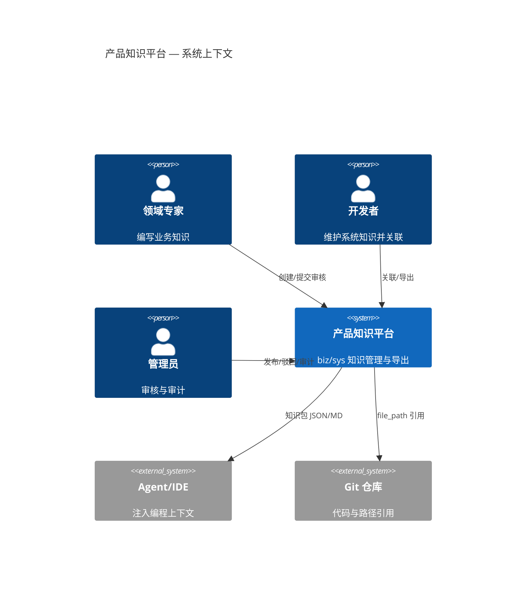

# C4 Level 1 — 系统上下文

## 系统

**产品知识平台（pm-kl-management）** — 在企业 AI 编程场景下，管理业务知识（biz_kl）与系统知识（sys_kl），并导出供 Agent/IDE 消费的知识包。

## 外部角色

| 角色 | 说明 |
|------|------|
| 领域专家 | 创建/维护 biz_kl 业务知识条目 |
| 开发者 | 维护 sys_kl、关联 biz_kl、导出知识包 |
| 管理员 | 审核发布、驳回、查看审计日志 |
| Agent/IDE | 消费导出的 JSON/Markdown 知识包（只读） |
| Git 仓库 | sys_kl 可选引用代码路径（未来 AST 同步） |

## 上下文图

