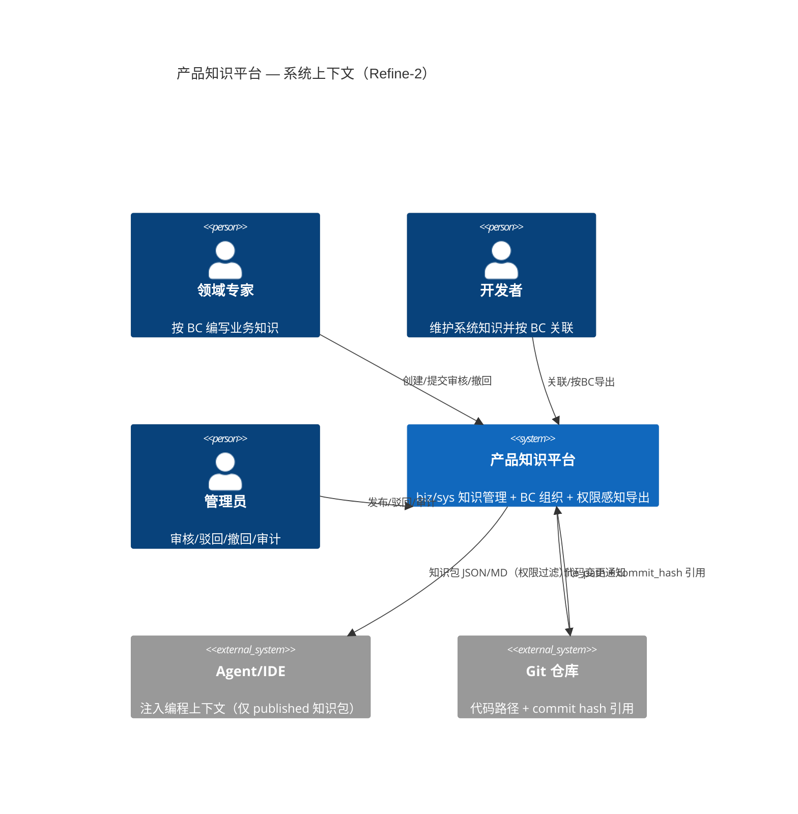

# C4 Level 1 — 系统上下文

## 系统

**产品知识平台（pm-kl-management）** — 在企业 AI 编程场景下，管理业务知识（biz_kl）与系统知识（sys_kl），按 Bounded Context 组织，导出供 Agent/IDE 消费的结构化知识包。

## 外部角色

| 角色 | 说明 |
|------|------|
| 领域专家 | 创建/维护 biz_kl 业务知识条目，按 BC 贡献知识 |
| 开发者 | 维护 sys_kl、关联 biz_kl、按 BC 导出知识包 |
| 管理员 | 审核发布、驳回、撤回审批、查看审计日志 |
| Agent/IDE | 消费导出的 JSON/Markdown 知识包（仅 published 条目，按角色过滤） |
| Git 仓库 | sys_kl 引用代码路径 + commit hash，检测代码变更触发知识更新提醒 |

## 上下文图

## Refine-2 变更说明

相比 MVP 基线，本版本上下文图新增：
- Git 仓库的**双向关系**（平台引用代码路径，代码变更可通知平台更新知识）
- Agent/IDE 明确标注**仅消费 published 条目**（ADR-007 状态过滤）
- 领域专家增加**撤回**操作（ADR-006）
